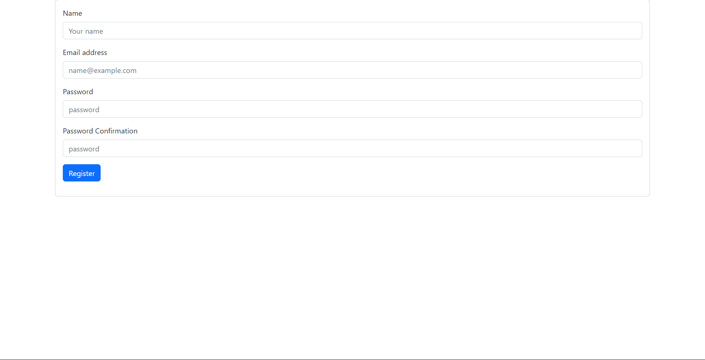
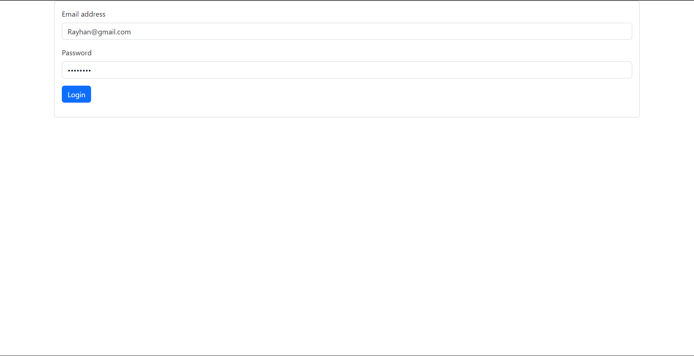

# PWF3
mebuat register dan register memerlukan email dan password untuk syarat register 

Setelah register akan daiarahkan langsung ke login jika berhasil maka akan diarahkan ke halaman home

Logout jika sudah masuk maka dibawah anda bisa logout

Pertama saya membuat tambahan 3 table yaitu pemasok,karywan,produk

yang kedua saya membuat fungsi pelanggan bisa create data dan read data menggunakan orm dan query builder

yang ketiga saya membuat fungsi produk bisa create data dan bisa read data juga sama seperti pelanggan

